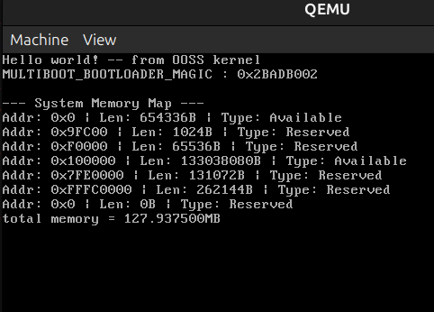

# OOSS
This is actual OOSS from scratch ☺️

Here I am writing 32bit kernel in c++ and kernel loader in x86_64 (not bootloader, I will use grub as bootloader)

### I am using Ubuntu to develop OOSS
## Requirements 
```bash
sudo apt-get install g++ binutils libc6-dev-i386 g++-multilib make qemu-system-x86 mtools xorriso grub-pc-bin
``` 

## Steps to run OOSS
### To boot from binary
1. ```make bin``` (to build project)
2. ```qemu-system-i386 -kernel ./build/mykernel.bin ```
3. Combined :
```bash
make bin && qemu-system-i386 -kernel ./build/mykernel.bin
```


### To boot from iso
1. ```make iso``` (to build project)
2. ```qemu-system-i386 -cdrom build/mykernel.iso```
3. Combined :
```bash
make iso && qemu-system-i386 -cdrom build/mykernel.iso
```
### To boot from VirtualBox
1. ```make iso```
2. Create new machine, named as "My Operating System" in VirtualBox using iso file made in build/mykernel.iso (This is one time step)
3. KVM (Kernel-based Virtual Machine) have control on VT-x, So to give VT-x to VirualBox we have to remove KVM <br>
    ```sudo modprobe -r kvm_intel; sudo modprobe -r kvm # for intel processors```
4. ```make run```
5. After running you may turn on KVM module again <br>
    ```sudo modprobe kvm_intel; sudo modprobe kvm```
6. Combined : (Dont forgot step2, step3 and step 5!!!)
```bash
make run
```

## What things are implemented in OOSS:
1. Custom printf utility (checkout ./utils_32bit/console.c)
2. Can use multiboot_info provided by grub bootloader
3. Calling global object constructors and destructors which are listed in ```.init_array``` and ```.fini_array``` sections
4. Can use keyboard input (typing on screen) by Polling method. (Without Interrupt Service)

## Learnings or some extra :
### 1. Using ```extern "C"``` in C++ :
1. To prevent "name mangling" or "name decoration" (compiler modifies name of function or variable for some use cases).
2. Use ```extern "C"``` if that function or variable is used by some program which is outside of current C++ file. e.g kernMain, callConstructors, clearScreen
### 2. ```callConstructors``` function :
1. This function is to call constructor of global instances (constructor for local instance is called without any problem but for global instance we need this special function)
### 3.  ```readelf``` and ```objdump``` : Tools to examine binaries
1. Use readelf for understanding the ELF file structure and how it loads into memory. 
2. Use objdump for disassembling code and general-purpose inspection.
### 4. also using ```ghidra``` for examine binaries (reverse engg) :
1. Go to Ghidra github repository : [official Ghidra github link](https://github.com/NationalSecurityAgency/ghidra)
2. Go to releases and download zip, ```unzip``` it, ```cd``` to it, run ```./ghidraRun```. 