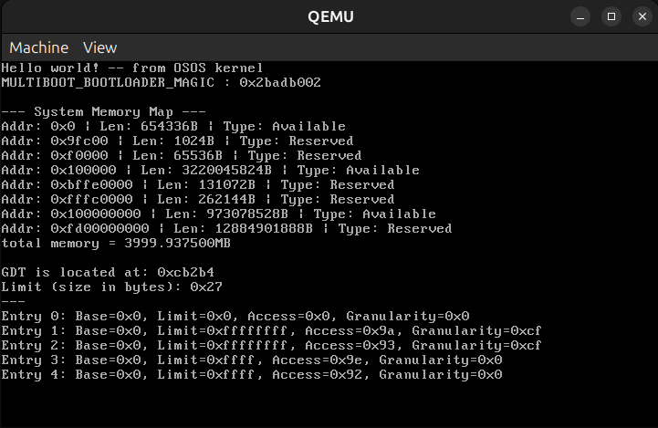
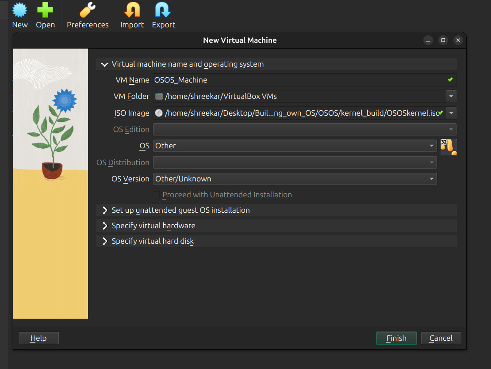
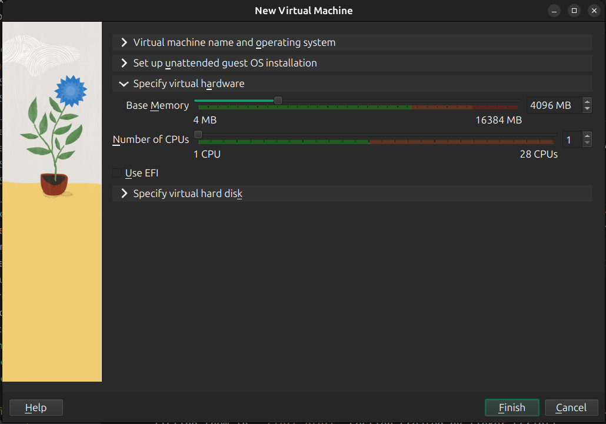
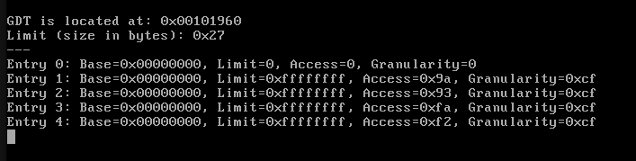
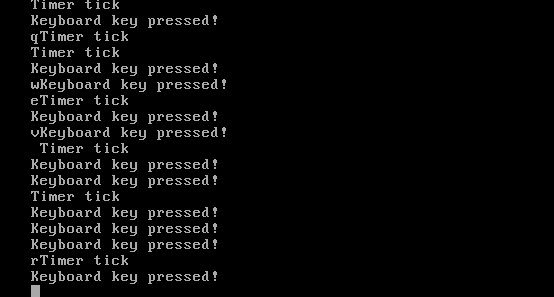

# OSOS
> This is actual OSOS from scratch ☺️. Here I am writing 32bit kernel in c++ and kernel loader in x86_64 (not bootloader, I will use grub as bootloader)

---
---

### I am using Ubuntu24.04 to develop OSOS
## Requirements 
### 1. Install reqrired tools
`bash
sudo apt-get install g++ binutils libc6-dev-i386 g++-multilib make qemu-system-x86 mtools xorriso grub-pc-bin
` 
### 2. GCC cross-compiler (i686-elf-TOOL)
Follow the Instructions in `../cross-compiler` and **make your own cross-compiler**. You will need cross-compiler due to some reasons that you will find in cross-compiler README.

#### If you dont want to make cross-compiler (which is not good idea) then you can go to this commit `f500e99459b3d1cf9e592b4be19fe4e2706ef2db` and follow current project and check whether you can build OSOS without cross compiler 🙂

---
---

## Steps to run OSOS
### To boot from binary (Using QEMU PC System emulator)
```bash
make # it will build OSOSkernel.bin and boot with QEMU 
```
<br>  <br>

### To boot from ISO (Using Virtual Box)
#### Before booting from ISO (VirtualBox) Create new machin using following instructions :
1. `make iso`
2.  Follow following steps to create Virtual Machine in Virtual Box
    1. Create New Machine in Virtual Box
    2. Set its name = "OSOS_Machine"
    3. Set ISO image = "our OSOS kernel ISO" (build by `make iso`)
    4. Set OS= "Other", Set OS Version = "Other/Unknown"
    <!-- <br>  <br> -->
    5. Set Base Memory = 4GB
    <!-- <br>  <br> -->
    6. Finish
### If you have Virtual Machine configured then you can directly run following command to start OSOS_Machine
```bash
make vm # it will build OSOSkernel.iso and boot with Virtual Machine (May ask for your sudo password)
```

---
---

## What things are implemented in OSOS:

1. Custom kernel library headers (checkout `./kernel_src/include` for headers and `./libk_src/` for their source code)
    1. **kiostream** : printf(), keyboard_input_by_polling(), clearScreen(), enable/update/disable_cursor()
    2. **kmemory** : printMemoryMap(), new()/delete() baby definitions ***(will update letter)***
    3. **kgdt** : class GDT with 1.methods : installTable | 2.static functions : kernel/user_CS/DS_selector()
    4. **kport** : class Port (which is base for class Port8bit, Port8bitslow, Port16bit, Port32bit) with methods : write(), read()
    5. **kicxxabi** : __callConstructors(), __cxa_finalize()
    6. **kinterrupt** : Have InterruptManager, which can manage interrupts. 

2. Accessed multiboot info structure provided by grub bootloader.

3. Calling global object constructors and destructors which are listed in `.ctors` and `.dtors` sections of corresponding object files.

4. Can use keyboard input by Polling method. (Without Interrupt Service)

5. Initialized Global Descriptor Table (GDT) as follows :
<br>  <br>
Currently I am not separating kernel and user space (Ring0 and Ring3), That is security issue; but I will implement paging in future so there is no need for separating kernel and user space in GDT (currently flat memory)

6. Initialized Interrupt Descriptor Table (IDT) to enable interrupts and make OSOS an interrupt driven OS.
<br>  <br>
This is beatutiful ScreenShot of switching between Timer Interrupt and Keyboard Interrupt :)
---
---

## To correctly compile, link and run OSOS

### 1. Using `extern "C"`keyword :
- To prevent "name mangling" or "name decoration" (compiler modifies name of function or variable for some use cases).
- Use `extern "C"` if that function or variable is used by some program which is outside of current C++ file. e.g kernMain, callConstructors, clearScreen

### 2. `kicxxabi.cpp` in libk_src :
- This is **Kernel Internal C++ Application Binary Interface**. Used by compiler while setting up virtual destructors etc.
- **__callConstructors()** and **__cxa_finalize()** are implemented to call global constructors and destructors

---
---
## Some extra :

### 1.  `readelf` and `objdump` : Tools to examine binaries
- Use readelf for understanding the ELF file structure and how it loads into memory. 
- Use objdump for disassembling code and general-purpose inspection.

### 2. Using `ghidra` for examine binaries (reverse engg) :
1. Go to Ghidra github repository : [official Ghidra github link](https://github.com/NationalSecurityAgency/ghidra)
2. Go to releases and download zip, `unzip` it, `cd` to it, run `./ghidraRun`. 

### 3. My personal rules while developing OSOS
- Using `#include <>` for standard libraries
- Using `#include ""` for OSOS specific libraries, e.g. libraries in `./kernel_src/include/`
- Naming OSOS kernel libraries with prefix `'k'`, e.g. kiostream, kmemory, etc


---
---