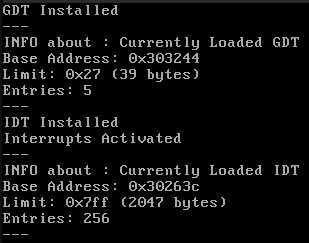
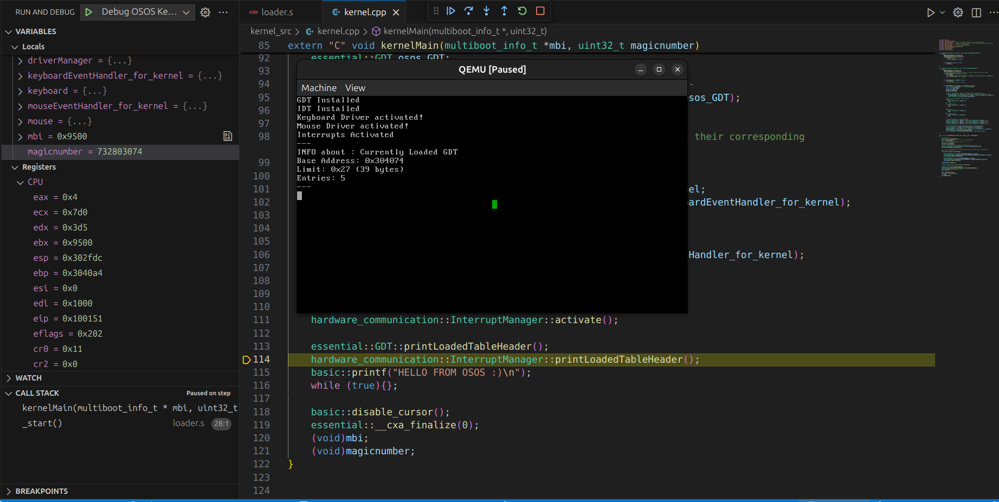

# OSOS
> This is actual OSOS from scratch ☺️. Here I am writing 32bit kernel in c++ and kernel loader in x86_64 (not bootloader, I will use grub as bootloader)
---
---
### progress in OSOS (9th Jan 2026) : [progress in brief (hindi)](https://www.youtube.com/watch?v=1927bI2CMLE)

## Documentation for OSOS development : [HTML page for OSOS](https://shreekar2005.github.io/Building_own_OS/)

### I am using Ubuntu24.04 to develop OSOS
## Requirements (be sure that you dont have conflicting installations e.g. VirtualBox downloaded from oracle website)
### 1. Install reqrired tools
```bash
sudo apt update
sudo apt install make
```
### 2. Install dependencies (Ubuntu 24.04.3 LTS)
```bash
make setup
```

### 3. GCC cross-compiler (i686-elf-TOOL or osos-TOOL)
Follow the Instructions in `../cross-compiler` and **make your own cross-compiler**. You will need cross-compiler due to some reasons that you will find in cross-compiler's README.

#### If you dont want to make cross-compiler (which is not good idea) then you can go to this commit `f500e99459b3d1cf9e592b4be19fe4e2706ef2db` and follow current project and check whether you can build OSOS without cross compiler 🙂

---
---

## Steps to run OSOS
### To boot from binary (Using QEMU PC System emulator)
```bash
make # it will build OSOSkernel.elf and boot with QEMU 
```
<br>  <br>

### To boot from ISO (Using Virtual Box)
#### Before booting from ISO (VirtualBox) Create new machin using following instructions :
1. `make iso`
2.  Follow following steps to create Virtual Machine in Virtual Box
    1. Create New Machine in Virtual Box
    2. Set its name = "OSOS_Machine"
    3. Set ISO image = "our OSOS kernel ISO" (build by `make iso`)
    4. Set OS= "Other", Set OS Version = "Other/Unknown"
    <!-- <br>  <br> -->
    5. Set Base Memory = 4GB
    <!-- <br>  <br> -->
    6. Finish
### If you have Virtual Machine configured then you can directly run following command to start OSOS_Machine
```bash
make vm # it will build OSOSkernel.iso and boot with Virtual Machine (May ask for your sudo password)
```

### *Read "Instructions" written in "Makefile" for more make procedures.*
---
---

Here is the updated **Features Implemented** list for OSOS, reflecting your new file structure and the addition of the memory management modules.

## What things are implemented in OSOS:

1. **Custom kernel library headers** (checkout `./libk_header` for headers and `./libk_src/` for their source code)
* **basic** :
    1. **kiostream.hpp** : `printf()`, `clearScreen()`, `enable/update/disable_cursor()`.
    2. **multiboot.h** : Structures for multiboot information provided by GRUB.
    3. **kstring.hpp** : Basic string manipulation functions.

* **memory** :
    1. **kpmm.hpp** : **Physical Memory Manager**. manages allocation and deallocation of physical page frames.
    2. **kpaging.hpp** : **Virtual Memory Manager**. Handles Page Directories and Page Tables to map virtual addresses to physical addresses.
    3. **kheap.hpp** : **Kernel Heap Manager**. Implements `malloc`, `free`, and C++ `new`/`delete` operators for dynamic memory allocation.

* **driver** :
    1. **kdriver.hpp** : Base class to manage driver activation.
    2. **kmouse.hpp** : Mouse driver interface for handling mouse interrupts and packets.
    3. **kkeyboard.hpp** : Keyboard driver interface for handling scancodes and input.
    4. **kserial.hpp** : Serial driver to handle COM1 interrupts and communicate via the serial port.

* **essential** :
    1. **kgdt.hpp** : GDT (Global Descriptor Table) setup for segment selectors.
    2. **kicxxabi.hpp** : C++ ABI support (`__callConstructors`, `__cxa_finalize`) for global objects.
    3. **kmultitasking.hpp** : Structures for `KernelThread`, `CPUState`, and the `KernelThreadManager`.

* **hardware_communication** :
    1. **kport.hpp** : I/O Port wrappers (`write`, `read`) for 8-bit, 16-bit, and 32-bit ports.
    2. **kinterrupt.hpp** : `InterruptManager` to handle IDT and ISRs.
    3. **kpci.hpp** : `PCI_Controller` to enumerate and control PCI devices.

2. Accessed **multiboot info structure** provided by the GRUB bootloader.
3. **C++ Runtime Support**: calling global object constructors and destructors using **essential/kicxxabi**.
4. **Segmentation & Interrupts**:
    * Initialized **Global Descriptor Table** (GDT).
    * Initialized **Interrupt Descriptor Table** (IDT) to enable hardware interrupts.

         

5. **Keyboard Support**: Handles interrupts (IRQ 1) via custom ISRs.
6. **Mouse Support**: Handles interrupts (IRQ 12) via custom ISRs.
7. **PCI Support**: Communicates with and enumerates peripheral devices using **PCI_Controller**.
8. **KernelShell**: Basic command-line interface (in `kernel.cpp`).
    * **Supported Commands**:
        * `help` : list commands
        * `clear` : clear shell
        * `lsmem` : print memory map provided by grub
        * `checkmem` : check how much memory is free (in KB)
        * `checkheap` : examine kernel heap
        * `lspagedir` : check active page directory entries for kernel
        * `lspci` : list PCI devices
        * `task<i>` : start ith task (thread) from OSOS shell
        * `numtasks` : to see number of tasks in shell list
9. **Multitasking System**:
    * Implemented `KernelThreadManager` capable of context switching.
    * Uses **Round Robin scheduling** to cycle through active threads.
    * Each thread has its own dedicated stack and saved `CPUState`.


10. **Advanced Memory Management**:
    * **Physical Memory**: Tracks used/free physical RAM.
    * **Paging**: Enabled paging mechanism to abstract physical memory.
    * **Dynamic Allocation**: Full support for standard C++ dynamic allocation (`new`, `delete`, `new[]`, `delete[]`) backed by a custom heap implementation.

---
---

## While Developing OSOS 

### 1. Using `extern "C"`keyword :
- To prevent "name mangling" or "name decoration" (compiler modifies name of function or variable for some use cases).
- Use `extern "C"` if that function or variable is used by some program which is outside of current C++ file. e.g kernMain, callConstructors, clearScreen

### 2. `kicxxabi.cpp` in libk_src/essential :
- This is **Kernel Internal C++ Application Binary Interface**. Used by compiler while setting up virtual destructors etc.
- **__callConstructors()** and **__cxa_finalize()** are implemented to call global constructors and destructors

---
---

## Using GDB (debugger) with our OSOS (running on qemu)
```bash
make dbg_cli
```
(run `make clean` which is recommanded before running `make debug`)

### How GDB and QEMU work together :
1. Run QEMU with `-s` (for connecting with GDB on port 1234) and `-S` (To pause VM at very begginning. Resume VM with `c` in GDB).
2. In another terminal start gdb, in gdb connect with remote target (qemu VM) using `target remote localhost:1234`
3. Load symbol table using any symbol file of our OS : `symbol-file kernel_build/OSOSkernel.elf`
4. Set breakpoints : e.g. `break kernelMain`
5. Continue QEMU with `c` (which will pause at next breakpoint).
- For good understanding you can see this "[YouTube Video Tutorial on "Using GDB for OS dev](https://youtu.be/H7SIDK6CiA4?si=swEXoYi1ppiO0EiO)" by me (***HINDI***) :)

### For VSCode users:
- It is recommanded to work in `<repo_path>/OSOS/`
- I have also added my `.vscode`. By those config files I can directly run OSOSkernel.elf from `Run Code` and can debug using `Debug C/C++ file` (in VSCode you may use keyboard shortcuts like `f5`, `f6`, etc. for better experience... )
- Below is ScreenShot while using GDB with VSCode for debugging OSOS :)
<br>  <br>
---
---

## Some extra :

### 1.  `readelf` and `objdump` : Tools to examine binaries
- Use readelf for understanding the ELF file structure and how it loads into memory. 
- Use objdump for disassembling code and general-purpose inspection.

### 2. Using `ghidra` for examine binaries (reverse engg) :
1. Go to Ghidra github repository : [official Ghidra github link](https://github.com/NationalSecurityAgency/ghidra)
2. Go to releases and download zip, `unzip` it, `cd` to it, run `./ghidraRun`. 

### 3. My personal rules while developing OSOS (IMP if you are thinking to Contribute)
- Using `#include <>` for standard libraries
- Using `#include ""` for OSOS specific libraries, e.g. libraries in `./libk_headers/`
- Naming OSOS kernel libraries with prefix `'k'`, e.g. kiostream.hpp, kmemory.hpp, etc
- **Naming convensions :**  pointer names : `abc_xyz_pqr`, class/struct names :  `AbcXyzPqr` or `ABC_XyzPqr`, function/variable names : `abcXyzPqr`
- all kernel library functions, classes, variables are divided in **`namespaces`** : 
    1. **basic** : kiostream, kmemory
    2. **driver** : kdriver, kkeyboard, kmouse
    3. **essential** : kgdt, kicxxabi
    4. **hardware_communication** : kinterrupt, kport

### 4. Interrupts :
- **PIC (Programmable Interrupt Controller):** It recieves hardware Interrupt Requests (IRQs) and send the interruptNumber to CPU. CPU then go to IDT entry correspondin to interrupt number. There are 2 PICs (Master and Slave) and Slave is attached to one of input line of Master PIC
- There are **Software Interrupts** that are recieved by CPU (e.g. divide by zero with interruptNumber = 0x00). So we should make their handlers also and keep their reference in IDT.
- **Main Issue of PIC** : Actually PIC also recives IRQ number from 0x00 (e.g. Timer IRQnumber=0x00, Keyboard IRQnumber=0x01). So PIC just cannot forward that number to CPU because then CPU will just call same handler for 'divide by zero' and 'Timer' interrupt. So we will add some offset(0x20 for Master PIC and 0x28 for Slave PIC) such that new interrupt number of IRQ will not conflict with Software Interrupt number.

### 5. How to add driver to OSOS kernel :
- Suppose you want some `xyz` driver
1. Write driver header in `libk_header/driver/kxyz.hpp`
2. Write driver implementation in `libk_src/driver/kxyz.cpp`
3. Make one `xyzEventHandler` class which will have some virtual functions e.g. onDataReceived, onClick etc. (To be overrided according to use)
4. Make one `xyzDriver` class to add driver which will inherit `public hardware_communication::InterruptHandler, public driver::Driver` (so now you have to override their virtual functions in your xyzDriver)
5. Add `void handleIRQ0xZZ();` line in `libk_header/hardware_communication/kinterrupt.hpp` (where you will see `extern "C"`), where "ZZ" is IRQ number for interrupt.
6. Add `handleIRQ 0xZZ, 0xZZ` line in `libk_src/hardware_communication/kinterruptstub.s`
7. Add `setIDTEntry(0xYY, kernelCSselectorOffset, &handleIRQ0xZZ, 0, IDT_INTERRUPT_GATE);` in constructor of `InterruptManager` that you will find in `libk_src/hardware_communication/kinterrupt.cpp`, where YY is interrupt number that CPU will see (After adding some offset like 0x20 or 0x27 to IRQ)
8. make `xyzEventHandler_for_kernel` class in kernel.cpp where you will inherit `xyzEventHandler` and override its virtual functions.
9. now add these lines to kernel.hpp, just before `driverManager.activateAll();`
```cpp
xyzEventHandler_for_kernel xyzEventHandler_for_kernel();
driver::xyzDriver xyzdriver(&osos_InterruptManager, &xyzEventHandler_for_kernel);
driverManager.addDriver(&xyzdriver);
```
- Now your driver is installed and its entry is also registered in IDT (for handling interrupt).
---
---


## One thing which blew my mind :
In early days, many machines have only support to 32bit programs (only 4GB addressable memory). After introduction to 64bit systems some people developed **UEFI** (which is BIOS but it have mini-OS which runs in 64bit). Now I have ***ASUS TUF F15 (GAMING 2022)*** in which there is no option to keep BIOS in **"Legacy Mode"** or turn on **"CSM"**. So on my machine i cannot boot in 32bit OS. In today's date there are many laptops which supports both modern and legacy mode, but my laptop sucks :(. If you want to boot 32bit OSOS then you have to first disable **"Secure boot"** and then turn on **"CSM"** or switch to **"Legacy Mode"** from BIOS

---
---
