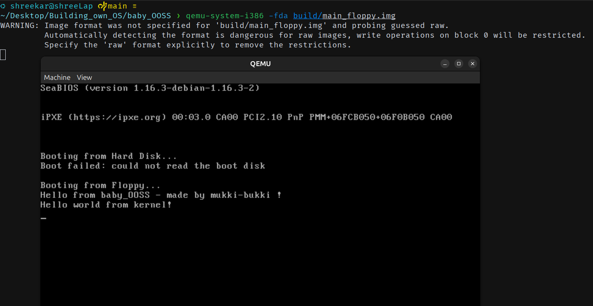

# baby_OSOS
This is baby version of OSOS (baby_OSOS) from scratch ☺️

Here we wrote kernel and bootloader in assembly.

We are loading bootloader from floppy image (which is actually virtual image of floppy disk)

baby_OSOS have simple job :
1. loads bootloader and say hello from baby_OSOS
2. load kernel from bootloader and say hello from kernel 
 
For actual OSOS we will work in C++

### we are using Ubuntu to develop OSOS
## Requirements 
1. ```sudo apt install mtools``` (we are using mcopy in Makefile)
2. ```sudo apt install nasm``` (to assemble assembly code)
3. ```sudo apt install qemu-system-x86``` (to run OS from CMD.)

## Steps to run baby_OSOS
1. clone this repo
1. ```cd OSOS/baby_OSOS```
2. ```make``` (to build project)
3. ```qemu-system-i386 -fda build/main_floppy.img``` (to boot baby_OSOS virtually)


## Demo images
1. How this OS looks (He can greet from bootloader and kernel as well, hehe) 

