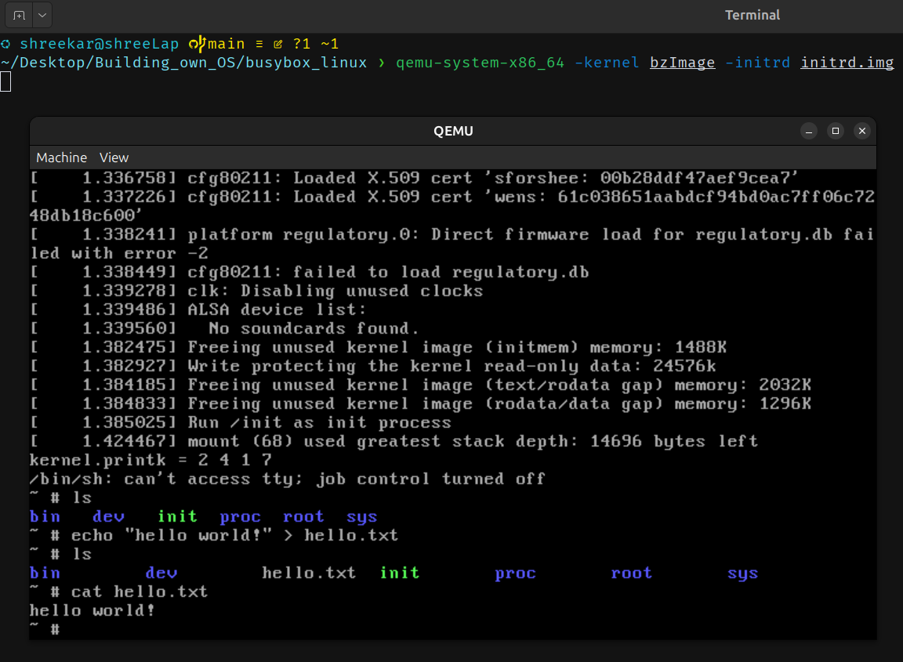
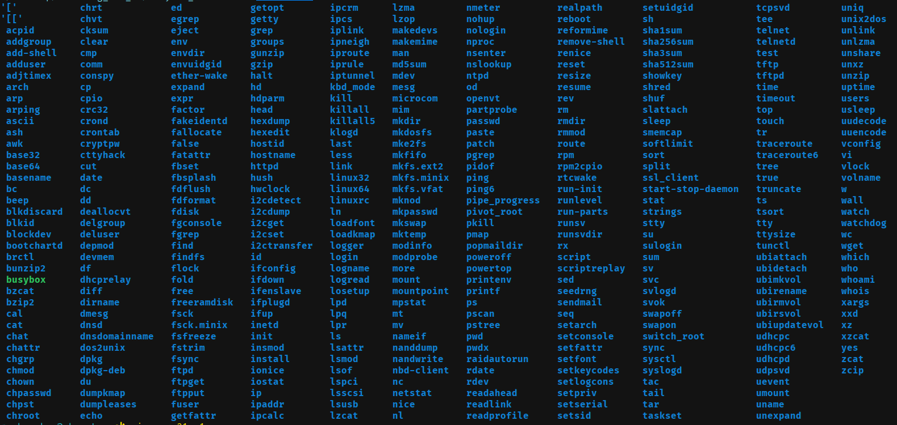

# Minimal linux using busybox

This is minimal linux. There are many basic linux commands like cd, ls, mkdir, cat, echo, arp, and so on...

follow steps to run and explore more !!! and contribute more !!!

### This OS build is working on debian based linux machine, Not tested on other linux distributions

### You may find these links useful!
1. kernel src (download) : https://mirrors.edge.kernel.org/pub/linux/kernel/
2. busybox srs (download) : https://busybox.net/downloads/
3. know more about busybox : https://busybox.net/

### Requirements
1. ``` sudo apt-get install flex bison```
2. ``` sudo apt-get install libelf-dev```
3. ``` sudo apt-get install libssl-dev```
4. ```sudo apt install qemu-system-x86``` (to run OS from CMD.)

### Steps to run 
1. Connect to internet :)
2. ``` ./busyboxx.sh ``` 
3. ``` qemu-system-x86_64 -kernel bzImage -initrd initrd.img```

#### If you got some error (NOT warning) then you can create Issue for that.
Also remember that this is specifially for debian based linux development environments 

## Demo image 
1. how this OS looks like and works like -

2. which commands are functional in this OS -



